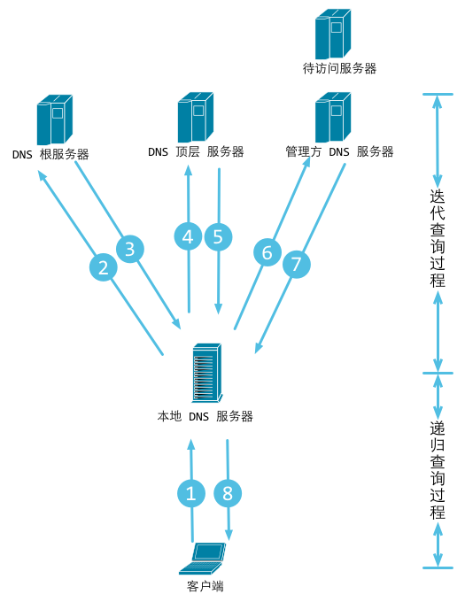

GoLangNote
===
[TOC]

# 包与导入

每个Go程序都是由包构成。

程序从main包开始运行。

写一个packages.go程序，本程序通过导入路径"fmt"和"math/rand"来使用这两个包，包路径必须用双引号。

packages.go:

```
package main

import (
  "fmt"
  "math/rand"
)

func main() {
  fmt.Println("My favorite number is", rand.Intn(20))
  fmt.Println(math.Pi)
}

```

按照约定，包名与导入路径的最后一个元素一致。例如，'math/rand'包中的源码均以package rand 语句开始。

本程序可以很好的体现Go是如何导入包，还有导入语句的用法。

其中，导入不仅可以通过圆括号分组导入，也可以分开写的，比如，'import fmt'，推荐分组导入。

在Go中，如果一个名字以大写字母开头，那么它就是已导出的。比如本程序的Println和Pi。如果将 Pi 写成 pi，是不允许的。

# 函数

函数可以没有参数，比如main，也可以设置参数类型，设置返回参数类型，比如add，注意类型在**变量之后**。

相同类型的参数，可以将 x int, y int 写成 x, y int。

函数返回值可以是任意类型的，多返回值用圆括号括起来，比如 swap。

Go的返回值可命名，它们被视为定义在函数顶部的变量，没有参数的return语句将直接返回已命名的返回值，比如split，不过一般短函数这么写可以，长函数将会影响可读性。

functions.go:

```
package main

import "fmt"

func add(x int, y int) int {
  return x + y
}

func swap(x, y string) (string, string) {
  return y, x
}

func split(sum int) (x, y int) {
  x = sum * 4 / 9
  y = sum - x
  return
}

func main() {
  fmt.Println(add(3, 5))
  fmt.Println(swap('wiz', 'kobe'))
  fmt.Println(split(36))
}

```

# 变量

变量类型写在最后，如果变量初始化值已存在，则可以省略类型。

仅限于函数代码块中，可以使用 := 代替 var 声明变量

variables.go

```
package main

import "fmt"

var c, python, java bool

func main() {
  i, j := 1, 2
  fmt.Println(i, j, c, python, java)

}
```

# 基本类型

Go 的基本类型有

```
bool

string

int  int8  int16  int32  int64
uint uint8 uint16 uint32 uint64 uintptr

byte // uint8 的别名

rune // int32 的别名
    // 表示一个 Unicode 码点

float32 float64

complex64 complex128
```
本例展示了几种类型的变量。 同导入语句一样，变量声明也可以“分组”成一个语法块。

int, uint 和 uintptr 在 32 位系统上通常为 32 位宽，在 64 位系统上则为 64 位宽。 当你需要一个整数值时应使用 int 类型，除非你有特殊的理由使用固定大小或无符号的整数类型。

basic-types.go
```
package main

import (
  "fmt"
  "math/cmplx"
)

var (
  Tobe    bool      = false
  MaxInt  uint64    = 1<<64 - 1
  z       complex64 = cmplx.Sqrt(-5 + 12i)
)

func main() {
  fmt.Printf("Type: %T Value: %v\n", ToBe, ToBe)
  fmt.Printf("Type: %T Value: %v\n", MaxInt, MaxInt)
  fmt.Printf("Type: %T Value: %v\n", z, z)
}
// Type: bool Value: false
// Type: uint64 Value: 18446744073709551615
// Type: complex128 Value: (2+3i)

```

没有明确初始值的变量声明会被赋予它们的 零值。

零值是：

数值类型为 0，
布尔类型为 false，
字符串为 ""（空字符串）。

表达式 T(v) 将值 v 转换为类型 T。

一些关于数值的转换：
```
var i int = 42
var f float64 = float64(i)
var u uint = uint(f)
```
或者，更加简单的形式：
```
i := 42
f := float64(i)
u := uint(f)
```
与 C 不同的是，Go 在不同类型的项之间赋值时需要显式转换。试着移除例子中 float64 或 uint 的转换看看会发生什么。

# 常量

常量的声明与变量类似，只不过是使用 const 关键字。

常量可以是字符、字符串、布尔值或数值。

常量不能用 := 语法声明。

数值常量是高精度的值。

一个未指定类型的常量由上下文来决定其类型。

再尝试一下输出 needInt(Big) 吧。

（int 类型最大可以存储一个64位的整数，有时会更小。）

（int 可以存放最大64位的整数，根据平台不同有时会更少。）

numeric-constant.go
```
package main

import "fmt"

const (
  // 将 1 左移 100 位来创建一个非常大的数字
  // 即这个数的二进制是 1 后面跟着 100 个 0
  Big = 1 << 100
  // 再往右移 99 位，即 Small = 1 << 1，或者说 Small = 2
  Small = Big >> 99
)

func needInt(x int) int { return x*10 + 1 }
func needFloat(x float64) float64 {
  return x * 0.1
}

func main() {
  fmt.Println(Small)
  fmt.Println(needInt(Small))
  fmt.Println(needFloat(Small))
  fmt.Println(needFloat(Big))
}

```
# for

Go 只有一种循环结构：for 循环。

基本的 for 循环由三部分组成，它们用分号隔开：

初始化语句：在第一次迭代前执行
条件表达式：在每次迭代前求值
后置语句：在每次迭代的结尾执行
初始化语句通常为一句短变量声明，该变量声明仅在 for 语句的作用域中可见。

一旦条件表达式的布尔值为 false，循环迭代就会终止。

> 注意：和 C、Java、JavaScript 之类的语言不同，Go 的 for 语句后面的三个构成部分外没有小括号， 大括号 { } 则是必须的。

```
package main

import "fmt"

func main() {
  sun := 0
  for i := 0; i < 10; i++ {
    sum += i
  }
  fmt.Parintln(sum)
}
```

初始化语句和后置语句是可选的。

```
for ; sum < 1000; {
  // TODO
}
```

Go 中的 "while"，其实就是for去掉分号

```
for sum < 1000 {

}
```

无线循环，只需去除for的循环条件。

```
for {

}
```
# if 

Go 的 if 语句与 for 循环类似，表达式外无需小括号 ( ) ，而大括号 { } 则是必须的。

```
package main

import (
  "fmt"
  "math"
)

func sqrt(x float64) string {
  if x < 0 {
    return sqrt(-x) + "i"
  }
  return fmt.Sprint(math.Sqrt(x))
}

func main() {
  fmt.Println(sqrt(2), sqrt(-4))
}
```

**if 的简短语句**

同 for 一样， if 语句可以在条件表达式前执行一个简单的语句。

该语句声明的变量作用域仅在 if 之内。

（在最后的 return 语句处使用 v 看看。）

if-with-a-short-statement.go
```
package main

import (
  "fmt"
  "math"
)

func pow(x, n, lim float64) float64 {
  if v:= math.Pow(x, n); v < lim {
    return v
  }
  return lim
}

func main() {
  fmt.Println(
    pow(3, 2, 10),
    pow(3, 3, 20),
  )
}
```

**if 和 else**

在 if 的简短语句中声明的变量同样可以在任何对应的 else 块中使用。

（在 main 的 fmt.Println 调用开始前，两次对 pow 的调用均已执行并返回其各自的结果。）

if-and-else.go
```
package main

import (
  "fmt"
  "math"
)

func pow(x, n, lim float64) float64 {
  if v:= math.Pow(x, n); v < lim {
    return v
  } else {
    fmt.Println("%g >= %g\n", v, lim)
  }
  return lim
}

func main() {
  fmt.Println(
    pow(3, 2, 10),
    pow(3, 3, 20),
  )
}
```

# 用牛顿法实现 Sqrt 方法

**牛顿法**

求导

x^n' = nx^(n - 1) => x^2 = 2x

设r是f(x) = 0的根，选取x0作为r初始近似值，过点（x0,f(x0)）做曲线y = f(x)的切线L，L的方程为y = f(x0)+f'(x0)(x-x0)，求出L与x轴交点的横坐标 x1 = x0-f(x0)/f'(x0)，称x1为r的一次近似值。

```
package main

import (
  "fmt"
)

func Sqrt(x float64) float64 {
  m := float64(1)
  m = (m + x/m)/2
  n := m * m - x
  for n > 0 {
    m = (m + x/m)/2
    n = m * m - x
  }
  return m
}

func main() {
  fmt.Println(Sqrt(27))
}

```

# switch

switch 是编写一连串 if - else 语句的简便方法。它运行第一个值等于条件表达式的 case 语句。

Go 的 switch 语句类似于 C、C++、Java、JavaScript 和 PHP 中的，不过 Go 只运行选定的 case，而非之后所有的 case。 实际上，Go 自动提供了在这些语言中每个 case 后面所需的 break 语句。 除非以 fallthrough 语句结束，否则分支会自动终止。 Go 的另一点重要的不同在于 switch 的 case 无需为常量，且取值不必为整数。

switch.go
```
package main

import (
  'fmt'
  'runtime'
)

func main() {
  fmt.Print("Go runs on ")
  Print(runtime.GOOS)
  Println(runtime.GOOS)
  switch os := runtime.GOOS; os {
    case "darwin":
      fmt.Println("OS X.")
    case "Linux":
      fmt.Println("Linux.")
    default:
      fmt.Println("%s.\n", os)
  }
}
```

**没有条件的 switch**

没有条件的 switch 同 switch true 一样。

这种形式能将一长串 if-then-else 写得更加清晰。

# defer

defer 语句会将函数推迟到外层函数返回之后执行。

推迟调用的函数其参数会立即求值，但直到外层函数返回前该函数都不会被调用。

**defer 栈**
推迟的函数调用会被压入一个栈中。当外层函数返回时，被推迟的函数会按照**后进先出**的顺序调用。

# 指针

Go 拥有指针。指针保存了值的内存地址。

类型 \*T  是指向 T 类型值的指针。其零值为 nil。
```
var p *int
```
& 操作符会生成一个指向其操作数的指针。
```
i := 42
p = &i
```
* 操作符表示指针指向的底层值。
fmt.Println(\*p) // 通过指针 p 读取 i
\*p = 21         // 通过指针 p 设置 i
这也就是通常所说的“间接引用”或“重定向”。
与 C 不同，Go 没有指针运算。

```
package main

import "fmt"

func main() {
  i, j := 42, 2701

  p := &i         // 指向 i
  fmt.Println(*p) // 通过指针读取 i 的值
  *p = 21         // 通过指针设置 i 的值
  fmt.Println(i)  // 查看 i 的值

  p = &j         // 指向 j
  fmt.Println(j) // 查看 j 的值
  *p = *p / 37   // 通过指针对 j 进行除法运算
  fmt.Println(j) // 查看 j 的值
}

```

# 结构体

一个结构体（struct）就是一组字段（field）。

structs.go
```
package main

import "fmt"

type Vertex struct {
  X int
  Y int
}

func main() {
  v = Vertex(1, 2)
  fmt.Println(v) // {1 2}
  fmt.Println(v.X) // 1
}
```
结构体字段使用点号来访问。

# 结构体指针
结构体字段可以通过结构体指针来访问。

如果我们有一个指向结构体的指针 p，那么可以通过 (\*p).X 来访问其字段 X。不过这么写太啰嗦了，所以语言也允许我们使用隐式间接引用，直接写 p.X 就可以，但是隐私间接引用仅限于结构体。

struct-pointers.go
```
package main

import "fmt"

type Vertex struct {
  X int
  Y int
}

func main() {
  v := Vertex{1, 2}
  p := &v
  p.X = 1e9
  fmt.Println(v)
  fmt.Println(p)
  fmt.Println(*p)
  fmt.Println("============")
  (*p).X = 1
  fmt.Println(v)
  fmt.Println(p)
  fmt.Println(*p)
}
```


**结构体文法**
结构体文法通过直接列出字段的值来新分配一个结构体。

使用 Name: 语法可以仅列出部分字段。（字段名的顺序无关。）

特殊的前缀 & 返回一个指向结构体的指针。

# 数组
类型 [n]T 表示拥有 n 个 T 类型的值的数组。

表达式

var a [10]int
会将变量 a 声明为拥有 10 个整数的数组。

数组的长度是其类型的一部分，因此数组不能改变大小。这看起来是个限制，不过没关系，Go 提供了更加便利的方式来使用数组。

array.go
```
package main 

import "fmt"

func main() {
  var a [2]int
  a[0] = 1
  a[1] = 3
  fmt.Println(a)

  primes = [3]string{"I" "love" "you"}
  fmt.Println(primes)
}
```

**切片**

切片通过两个下标来界定，即一个上界和一个下界，二者以冒号分隔：
```
a[low : high]
```
它会选择一个半开区间，包括第一个元素，但排除最后一个元素。

以下表达式创建了一个切片，它包含 a 中下标从 1 到 3 的元素：
```
a[1:4]
```

**切片文法**
切片文法类似于没有长度的数组文法。

这是一个数组文法：
```
[3]bool{true, true, false}
```
下面这样则会创建一个和上面相同的数组，然后构建一个引用了它的切片：
```
[]bool{true, true, false}
```

slice-literals.go
```
package main

import "fmt"

func main() {
  q := []int{2, 3, 5, 7, 11, 13}
  fmt.Println(q)

  r := []bool{true, false, true, true, false, true}
  fmt.Println(r)

  s := []struct {
    i int
    b bool
  }{
    {2, true},
    {3, false},
    {5, true},
    {7, true},
    {11, false},
    {13, true},
  }
  fmt.Println(s)
}
```

**切片的默认行为**
在进行切片时，你可以利用它的默认行为来忽略上下界。

切片下界的默认值为 0，上界则是该切片的长度。

对于数组
```
var a [10]int
```

来说，以下切片是等价的：
```
a[0:10]
a[:10]
a[0:]
a[:]
```

# 切片的长度与容量
切片拥有 长度 和 容量。

切片的长度就是它所包含的元素个数。

切片的容量是从它的第一个元素开始数，到其底层数组元素末尾的个数。

切片 s 的长度和容量可通过表达式 len(s) 和 cap(s) 来获取。

你可以通过重新切片来扩展一个切片，给它提供足够的容量。试着修改示例程序中的切片操作，向外扩展它的容量，看看会发生什么。

slice-len-cap.go
```
package main

import "fmt"

func printSlice(s []int) {
  fmt.Printf("len=%d cap=%d %v\n", len(s), cap(s), s)
}

func main() {
  s := []int{2, 3, 5, 7, 11, 13}
  printSlice(s)

  // 截取切片使其长度为 0
  s = s[:0]
  printSlice(s)

  // 拓展其长度
  s = s[:4]
  printSlice(s)

  // 舍弃前两个值
  s = s[2:]
  printSlice(s)
}

// len=6 cap=6 [2 3 5 7 11 13]
// len=0 cap=6 []
// len=4 cap=6 [2 3 5 7]
// len=2 cap=4 [5 7]
```

**nil 切片**
切片的零值是 nil。

nil 切片的长度和容量为 0 且没有底层数组。

# 用 make 创建切片
切片可以用内建函数 make 来创建，这也是你创建动态数组的方式。

make 函数会分配一个元素为零值的数组并返回一个引用了它的切片：
```
a := make([]int, 5)  // len(a)=5
```
要指定它的容量，需向 make 传入第三个参数：
```
b := make([]int, 0, 5) // len(b)=0, cap(b)=5

b = b[:cap(b)] // len(b)=5, cap(b)=5
b = b[1:]      // len(b)=4, cap(b)=4
```
# 向切片追加元素
为切片追加新的元素是种常用的操作，为此 Go 提供了内建的 append 函数。内建函数的文档对此函数有详细的介绍。

func append(s []T, vs ...T) []T
append 的第一个参数 s 是一个元素类型为 T 的切片，其余类型为 T 的值将会追加到该切片的末尾。

append 的结果是一个包含原切片所有元素加上新添加元素的切片。

当 s 的底层数组太小，不足以容纳所有给定的值时，它就会分配一个更大的数组。返回的切片会指向这个新分配的数组。

append.go
```
package main

import "fmt"

func main() {
  var s []int
  printSlice(s)


  // 可以一次性添加多个元素
  s = append(s, 2, 3, 4)
  printSlice(s)
}

func printSlice(s []int) {
  fmt.Printf("len=%d cap=%d %v\n", len(s), cap(s), s)
}
```

# Range
for 循环的 range 形式可遍历切片或映射。

当使用 for 循环遍历切片时，每次迭代都会返回两个值。第一个值为当前元素的下标，第二个值为该下标所对应元素的一份副本。

range.go
```
package main

import "fmt"

var pow = []int{1, 2, 4, 8, 16, 32, 64, 128}

func main() {
  for i, v := range pow {
    fmt.Printf("2**%d = %d\n", i, v)
  }
}
```

可以将下标或值赋予 _ 来忽略它。
```
for i, _ := range pow
for \_, value := range pow
```
若你只需要索引，忽略第二个变量即可。
```
for i := range pow
```

# 映射
映射将键映射到值。

映射的零值为 nil 。nil 映射既没有键，也不能添加键。

make 函数会返回给定类型的映射，并将其初始化备用。

maps.go
```
package main

import "fmt"

type Vertex struct {
  Lat, Long float64
}

func main() {
  m := make(map[string]Vertex)
  m["Bells Labs"] = Vertex {40.89434, -43.782344}
  fmt.Println(m["Bells Labs"])
}
```

**映射的文法**

映射的文法与结构体相似，不过必须有键名。

map-literals.go
```
package main

import "fmt"

type Vertex struct {
  Lat, Long float64
}

var m = map[string]Vertex{
  "Bell Labs": Vertex{
    40.68433, -74.39967,
  },
  "Google": Vertex{
    37.42202, -122.08408,
  },
}

func main() {
  fmt.Println(m)
}
```

若顶级类型只是一个类型名，你可以在文法的元素中省略它。

map-literals-continued.go
```
package main

import "fmt"

type Vertex struct {
  Lat, Long float64
}

var m = map[string]Vertex{
  "Bell Labs": {40.68433, -74.39967},
  "Google":    {37.42202, -122.08408},
}

func main() {
  fmt.Println(m)
}
```

**修改映射**
在映射 m 中插入或修改元素：
```
m[key] = elem
```
获取元素：
```
elem = m[key]
```
删除元素：
```
delete(m, key)
```
通过双赋值检测某个键是否存在：
```
elem, ok = m[key]
```
若 key 在 m 中，ok 为 true ；否则，ok 为 false。

若 key 不在映射中，那么 elem 是该映射元素类型的零值。

同样的，当从映射中读取某个不存在的键时，结果是映射的元素类型的零值。

注 ：若 elem 或 ok 还未声明，你可以使用短变量声明：
```
elem, ok := m[key]
```

mutating-maps.go
```
package main

import "fmt"

func main() {
  m := make(map[string]int)

  m["Answer"] = 42
  fmt.Println("The value:", m["Answer"])

  m["Answer"] = 48
  fmt.Println("The value:", m["Answer"])

  delete(m, "Answer")
  fmt.Println("The value:", m["Answer"])

  v, ok := m["Answer"]
  fmt.Println("The value:", v, "Present?", ok)

  m["Answer"] = 50
  v2, ok2 := m["Answer"]
  fmt.Println("The value:", v2, "Present?", ok2)
}

// The value: 42
// The value: 48
// The value: 0
// The value: 0 Present? false
// The value: 50 Present? true
```
# 函数值
函数也是值。它们可以像其它值一样传递。

函数值可以用作函数的参数或返回值。

function-values.go
```
package main

import (
  "fmt"
  "math"
)

func compute(fn func(float64, float64) float64) float64 {
  return fn(3, 4)
}

func main() {
  hypot := func(x, y float64) float64 {
    return math.Sqrt(x*x + y*y)
  }
  fmt.Println(hypot(5, 12))

  fmt.Println(compute(hypot))
  fmt.Println(compute(math.Pow))
}
```

**函数的闭包**
Go 函数可以是一个闭包。闭包是一个函数值，它引用了其函数体之外的变量。该函数可以访问并赋予其引用的变量的值，换句话说，该函数被这些变量“绑定”在一起。

例如，函数 adder 返回一个闭包。每个闭包都被绑定在其各自的 sum 变量上。

function-closures.go
```
package main

import "fmt"

func adder() func(int) int {
  sum := 0
  return func(x int) int {
    sum += x
    return sum
  }
}

func main() {
  pos, neg := adder(), adder()
  for i := 0; i < 10; i++ {
    fmt.Println(
      pos(i),
      neg(-2*i),
    )
  }
}
```

# 方法
Go 没有类。不过你可以为结构体类型定义方法。

方法就是一类带特殊的 接收者 参数的函数。

方法接收者在它自己的参数列表内，位于 func 关键字和方法名之间。

在此例中，Abs 方法拥有一个名为 v，类型为 Vertex 的接收者。

```
package main

import (
  "fmt"
  "math"
)

type Vertex struct {
  X, Y float64
}

func (v Vertex) Abs() float64 {
  return math.Sqrt(v.X*v.X + v.Y*v.Y)
}

func main() {
  v := Vertex{3, 4}
  fmt.Println(v.Abs())
}
```

**方法即函数**
记住：方法只是个带接收者参数的函数。

现在这个 Abs 的写法就是个正常的函数，功能并没有什么变化。

你也可以为非结构体类型声明方法。

> 译注：就是接收者的类型定义和方法声明必须在同一包内；不能为内建类型声明方法。

你可以为指针接收者声明方法。

## 指针接收者
你可以为指针接收者声明方法。

这意味着对于某类型 T，接收者的类型可以用 \*T 的文法。（此外，T 不能是像 \*int 这样的指针。）

例如，这里为 \*Vertex 定义了 Scale 方法。

指针接收者的方法可以修改接收者指向的值（就像 Scale 在这做的）。由于方法经常需要修改它的接收者，指针接收者比值接收者更常用。

若使用值接收者，那么 Scale 方法会对原始 Vertex 值的副本进行操作。（对于函数的其它参数也是如此。）Scale 方法必须用指针接受者来更改 main 函数中声明的 Vertex 的值。

methods-pointers.go
```
package main

import (
  "fmt"
  "math"
)

type Vertex struct {
  X, Y float64
}

func (v Vertex) Abs() float64 {
  return math.Sqrt(v.X*v.X + v.Y*v.Y)
}

func (v *Vertex) Scale(f float64) {
  v.X = v.X * f
  v.Y = v.Y * f
}

func main() {
  v := Vertex{3, 4}
  v.Scale(10)
  fmt.Println(v.Abs())
}
```

==

**方法与指针重定向**
比较前两个程序，你大概会注意到带指针参数的函数必须接受一个指针：
```
var v Vertex
ScaleFunc(v, 5)  // 编译错误！
ScaleFunc(&v, 5) // OK
```
而以指针为接收者的方法被调用时，接收者既能为值又能为指针：
```
var v Vertex
v.Scale(5)  // OK
p := &v
p.Scale(10) // OK
```
对于语句 v.Scale(5)，即便 v 是个值而非指针，带指针接收者的方法也能被直接调用。 也就是说，由于 Scale 方法有一个指针接收者，为方便起见，Go 会将语句 v.Scale(5) 解释为 (&v).Scale(5)。

indirection.go
```
package main

import "fmt"

type Vertex struct {
  X, Y float64
}

func (v *Vertex) Scale(f float64) {
  v.X = v.X * f
  v.Y = v.Y * f
}

func ScaleFunc(v *Vertex, f float64) {
  v.X = v.X * f
  v.Y = v.Y * f
}

func main() {
  v := Vertex{3, 4}
  v.Scale(2)
  ScaleFunc(&v, 10)

  p := &Vertex{3, 4}
  p.Scale(2)
  ScaleFunc(p, 10)

  fmt.Println(v, p)
}
```

同样的事情也发生在相反的方向。

接受一个值作为参数的函数必须接受一个指定类型的值：
```
var v Vertex
fmt.Println(AbsFunc(v))  // OK
fmt.Println(AbsFunc(&v)) // 编译错误！
```
而以值为接收者的方法被调用时，接收者既能为值又能为指针：
```
var v Vertex
fmt.Println(v.Abs()) // OK
p := &v
fmt.Println(p.Abs()) // OK
```
这种情况下，方法调用 p.Abs() 会被解释为 (\*p).Abs()。

indirection-values.go
```
package main

import (
  "fmt"
  "math"
)

type Vertex struct {
  X, Y float64
}

func (v Vertex) Abs() float64 {
  return math.Sqrt(v.X*v.X + v.Y*v.Y)
}

func AbsFunc(v Vertex) float64 {
  return math.Sqrt(v.X*v.X + v.Y*v.Y)
}

func main() {
  v := Vertex{3, 4}
  fmt.Println(v.Abs())
  fmt.Println(AbsFunc(v))

  p := &Vertex{4, 3}
  fmt.Println(p.Abs())
  fmt.Println(AbsFunc(*p))
}
```

使用指针接收者的原因有二：

首先，方法能够修改其接收者指向的值。

其次，这样可以避免在每次调用方法时复制该值。若值的类型为大型结构体时，这样做会更加高效。

通常来说，所有给定类型的方法都应该有值或指针接收者，但并不应该二者混用。

# 接口
接口类型 是由一组方法签名定义的集合。

接口类型的变量可以保存任何实现了这些方法的值。

一个接口类型的变量，可以通过以下方式调用接口下的方法:

```
type MyInter interface {
  MyFunc type
}

var a MyInter

a.MyFunc()
```

注意: 示例代码的 22 行存在一个错误。由于 Abs 方法只为 \*Vertex （指针类型）定义，因此 Vertex（值类型）并未实现 Abser。

interfaces.go 
```
package main

import (
  "fmt"
  "math"
)

type Abser interface {
  Abs() float64
}

func main() {
  var a Abser
  f := MyFloat(-math.Sqrt2)
  v := Vertex{3, 4}

  a = f
  a = &v

  // a = v // 错误

  fmt.Println(a.Abs())
}

type MyFloat float64

func (f MyFloat) Abs() float64 {
  if f < 0 {
    return float64(-f)
  }
  return float64(f)
}

type Vertex struct {
  X, Y float64
}

func (v *Vertex) Abs() float64 {
  return math.Sqrt(v.X*v.X + v.Y*v.Y)
}
```

**接口与隐式实现**
类型通过实现一个接口的所有方法来实现该接口。既然无需专门显式声明，也就没有“implements”关键字。

隐式接口从接口的实现中解耦了定义，这样接口的实现可以出现在任何包中，无需提前准备。

因此，也就无需在每一个实现上增加新的接口名称，这样同时也鼓励了明确的接口定义。

interface-are-statisfied-implicitly.go
```
package main

import "fmt"

type I interface {
  M()
}

type T struct {
  S string
}

// 此方法表示类型 T 实现了接口 I，但我们无需显式声明此事。
func (t T) M() {
  fmt.Println(t.S)
}

func main() {
  var i I = T{"hello"}
  i.M()
}
```

**接口值**
接口也是值。它们可以像其它值一样传递。

接口值可以用作函数的参数或返回值。

在内部，接口值可以看做包含值和具体类型的元组：

(value, type)
接口值保存了一个具体底层类型的具体值。

接口值调用方法时会执行其底层类型的同名方法。

interface-value.go
```
package main

import (
  "fmt"
  "math"
)

type I interface {
  M()
}

type T struct {
  S string
}

func (t *T) M() {
  fmt.Println(t.S)
}

type F float64

func (f F) M() {
  fmt.Println(f)
}

func main() {
  var i I

  i = &T{"Hello"}
  describe(i)
  i.M()

  i = F(math.Pi)
  describe(i)
  i.M()
}

func describe(i I) {
  fmt.Printf("(%v, %T)\n", i, i)
}
```

**底层值为 nil 的接口值**
即便接口内的具体值为 nil，方法仍然会被 nil 接收者调用。

在一些语言中，这会触发一个空指针异常，但在 Go 中通常会写一些方法来优雅地处理它（如本例中的 M 方法）。

注意: 保存了 nil 具体值的接口其自身并不为 nil。

interface-values-with-nil.go
```
package main

import "fmt"

type I interface {
  M()
}

type T struct {
  S string
}

func (t *T) M() {
  if t == nil {
    fmt.Println("<nil>")
    return
  }
  fmt.Println(t.S)
}

func main() {
  var i I

  var t *T
  i = t
  describe(i)
  i.M()

  i = &T{"hello"}
  describe(i)
  i.M()
}

func describe(i I) {
  fmt.Printf("(%v, %T)\n", i, i)
}
```

**nil 接口值**
nil 接口值既不保存值也不保存具体类型。

为 nil 接口调用方法会产生运行时错误，因为接口的元组内并未包含能够指明该调用哪个 具体 方法的类型。

**空接口**
指定了零个方法的接口值被称为 \*空接口：\*
```
interface{}
```
空接口可保存任何类型的值。（因为每个类型都至少实现了零个方法。）

空接口被用来处理未知类型的值。例如，fmt.Print 可接受类型为 interface{} 的任意数量的参数。

# 类型断言
类型断言 提供了访问接口值底层具体值的方式。

t := i.(T)
该语句断言接口值 i 保存了具体类型 T，并将其底层类型为 T 的值赋予变量 t。

若 i 并未保存 T 类型的值，该语句就会触发一个恐慌。

为了 判断 一个接口值是否保存了一个特定的类型，类型断言可返回两个值：其底层值以及一个报告断言是否成功的布尔值。

t, ok := i.(T)
若 i 保存了一个 T，那么 t 将会是其底层值，而 ok 为 true。

否则，ok 将为 false 而 t 将为 T 类型的零值，程序并不会产生恐慌。

请注意这种语法和读取一个映射时的相同之处。

type-assertions.go
```
package main

import "fmt"

func main() {
  var i interface{} = "hello"

  s := i.(string)
  fmt.Println(s)

  s, ok := i.(string)
  fmt.Println(s, ok)

  f, ok := i.(float64)
  fmt.Println(f, ok)

  f = i.(float64) // 报错(panic)
  fmt.Println(f)
}
```

**类型选择**
类型选择 是一种按顺序从几个类型断言中选择分支的结构。

类型选择与一般的 switch 语句相似，不过类型选择中的 case 为类型（而非值）， 它们针对给定接口值所存储的值的类型进行比较。
```
switch v := i.(type) {
case T:
    // v 的类型为 T
case S:
    // v 的类型为 S
default:
    // 没有匹配，v 与 i 的类型相同
}
```
类型选择中的声明与类型断言 i.(T) 的语法相同，只是具体类型 T 被替换成了关键字 type。

此选择语句判断接口值 i 保存的值类型是 T 还是 S。在 T 或 S 的情况下，变量 v 会分别按 T 或 S 类型保存 i 拥有的值。在默认（即没有匹配）的情况下，变量 v 与 i 的接口类型和值相同。

# Stringer
fmt 包中定义的 Stringer 是最普遍的接口之一。

type Stringer interface {
    String() string
}
Stringer 是一个可以用字符串描述自己的类型。fmt 包（还有很多包）都通过此接口来打印值。

stringer.go
```
package main

import "fmt"

type Person struct {
  Name string
  Age  int
}

func (p Person) String() string {
  return fmt.Sprintf("%v (%v years)", p.Name, p.Age)
}

func main() {
  a := Person{"Arthur Dent", 42}
  z := Person{"Zaphod Beeblebrox", 9001}
  fmt.Println(a, z)
}
```

# 错误
Go 程序使用 error 值来表示错误状态。

与 fmt.Stringer 类似，error 类型是一个内建接口：
```
type error interface {
    Error() string
}
```
（与 fmt.Stringer 类似，fmt 包在打印值时也会满足 error。）

通常函数会返回一个 error 值，调用的它的代码应当判断这个错误是否等于 nil 来进行错误处理。
```
i, err := strconv.Atoi("42")
if err != nil {
    fmt.Printf("couldn't convert number: %v\n", err)
    return
}
fmt.Println("Converted integer:", i)
```
error 为 nil 时表示成功；非 nil 的 error 表示失败。

errors.go
```
package main

import (
  "fmt"
  "time"
)

type MyError struct {
  When time.Time
  What string
}

func (e *MyError) Error() string {
  return fmt.Sprintf("at %v, %s",
    e.When, e.What)
}

func run() error {
  return &MyError{
    time.Now(),
    "it didn't work",
  }
}

func main() {
  if err := run(); err != nil {
    fmt.Println(err)
  }
}
```

**练习：错误**

修改Sqrt使其返回 error 值。

Sqrt 接受到一个负数时，应当返回一个非 nil 的错误值。复数同样也不被支持。

创建一个新的类型
```
type ErrNegativeSqrt float64
```
并为其实现
```
func (e ErrNegativeSqrt) Error() string
```
方法使其拥有 error 值，通过 **ErrNegativeSqrt(-2).Error()** 调用该方法应返回 "cannot Sqrt negative number: -2"。

> 注意: 在 Error 方法内调用 fmt.Sprint(e) 会让程序陷入死循环。可以通过先转换 e 来避免这个问题：fmt.Sprint(float64(e))。这是为什么呢？

修改 Sqrt 函数，使其接受一个负数时，返回 ErrNegativeSqrt 值。

exercise-errors.go
```
package main

import (
  "fmt"
  "math"
)


func Sqrt(x float64) (float64, error) {
  if x < 0 {
    return 0, ErrNegativeSqrt(x)
  }
  return math.Sqrt(x), nil
}
 
func main() {
  fmt.Println(Sqrt(2))
  fmt.Println(Sqrt(-2))
}

type ErrNegativeSqrt float64

func (e ErrNegativeSqrt) Error() string {
  return fmt.Sprint("cannot Sqrt negative number: ", e)
}
```

# Reader

io 包指定了 io.Reader 接口，它表示从数据流的末尾进行读取。

Go 标准库包含了该接口的许多实现，包括文件、网络连接、压缩和加密等等。

io.Reader 接口有一个 Read 方法：

func (T) Read(b []byte) (n int, err error)
Read 用数据填充给定的字节切片并返回填充的字节数和错误值。在遇到数据流的结尾时，它会返回一个 io.EOF 错误。

示例代码创建了一个 strings.Reader 并以每次 8 字节的速度读取它的输出。

reader.go
```
package main

import (
  "fmt"
  "io"
  "strings"
)

func main() {
  r := strings.NewReader("Hello, Reader!")

  b := make([]byte, 8)
  for {
    n, err := r.Read(b)
    fmt.Printf("n = %v err = %v b = %v\n", n, err, b)
    fmt.Printf("b[:n] = %q\n", b[:n])
    if err == io.EOF {
      fmt.Printf("EOF")
      break
    }
  }
}
```

**练习: rot13Reader**
有种常见的模式是一个 io.Reader 包装另一个 io.Reader，然后通过某种方式修改其数据流。

例如，gzip.NewReader 函数接受一个 io.Reader（已压缩的数据流）并返回一个同样实现了 io.Reader 的 \*gzip.Reader（解压后的数据流）。

编写一个实现了 io.Reader 并从另一个 io.Reader 中读取数据的 rot13Reader，通过应用 rot13 代换密码对数据流进行修改。

rot13Reader 类型已经提供。实现 Read 方法以满足 io.Reader。

exercise-rot-reader.go
```
package main

import (
  "io"
  "os"
  "strings"
  //"fmt"
)

type rot13Reader struct {
  r io.Reader
}

func (b *rot13Reader) Read(p []byte) (n int, err error) {
  n, err = b.r.Read(p)
  for i := range p[:n] {
    p[i] = rot13(p[i])
  }
  return
}

func rot13(b byte) byte {
  switch {
  case 'A' <= b && b <= 'M':
    b = (b - 'A') + 'N'
  case 'N' <= b && b <= 'Z':
    b = (b - 'N') + 'A'
  case 'a' <= b && b <= 'm':
    b = (b - 'a') + 'n'
  case 'n' <= b && b <= 'z':
    b = (b - 'n') + 'a'
  }
  return b
}

func main() {
  s := strings.NewReader("Abg whfg gb perngr cebterff ohg gb perngr checbfr!")
  r := rot13Reader{s}
  io.Copy(os.Stdout, &r)
}
```

#图像
image 包定义了 Image 接口：

package image

type Image interface {
    ColorModel() color.Model
    Bounds() Rectangle
    At(x, y int) color.Color
}
注意: Bounds 方法的返回值 Rectangle 实际上是一个 image.Rectangle，它在 image 包中声明。

（请参阅文档了解全部信息。）

color.Color 和 color.Model 类型也是接口，但是通常因为直接使用预定义的实现 image.RGBA 和 image.RGBAModel 而被忽视了。这些接口和类型由 image/color 包定义。

images.go
```
package main

import (
  "fmt"
  "image"
)

func main() {
  m := image.NewRGBA(image.Rect(0, 0, 100, 100))
  fmt.Println(m.ColorModel())
  fmt.Println(m.Bounds())
  fmt.Println(m.At(0, 0).RGBA())
}
```

# Go 程
Go 程（goroutine）是由 Go 运行时管理的轻量级线程。

go f(x, y, z)
会启动一个新的 Go 程并执行

f(x, y, z)
f, x, y 和 z 的求值发生在当前的 Go 程中，而 f 的执行发生在新的 Go 程中。

Go 程在相同的地址空间中运行，因此在访问共享的内存时必须进行同步。sync 包提供了这种能力，不过在 Go 中并不经常用到，因为还有其它的办法（见下一页）。

# 信道
信道是带有类型的管道，你可以通过它用信道操作符 <- 来发送或者接收值。
```
ch <- v    // 将 v 发送至信道 ch。
v := <-ch  // 从 ch 接收值并赋予 v。
```
（“箭头”就是数据流的方向。）

和映射与切片一样，信道在使用前必须创建：
```
ch := make(chan int)
```
默认情况下，发送和接收操作在另一端准备好之前都会阻塞。这使得 Go 程可以在没有显式的锁或竞态变量的情况下进行同步。

以下示例对切片中的数进行求和，将任务分配给两个 Go 程。一旦两个 Go 程完成了它们的计算，它就能算出最终的结果。

channels.go
```
package main

import "fmt"

func sum(s []int, c chan int) {
  sum := 0
  for _, v := range s {
    sum += v
  }
  c <- sum // 将和送入 c
}

func main() {
  s := []int{1, 1, 1, 2, 2, 2}

  c := make(chan int)
  go sum(s[:len(s)/2], c)
  go sum(s[len(s)/2:], c)
  x := <-c // 从 c 中接收
  y := <-c // 从 c 中接收

  fmt.Println(x, y)
}
```

# 带缓冲的信道
信道可以是 带缓冲的。将缓冲长度作为第二个参数提供给 make 来初始化一个带缓冲的信道：

ch := make(chan int, 100)
仅当信道的缓冲区填满后，向其发送数据时才会阻塞。当缓冲区为空时，接受方会阻塞。

buffered-channels.go
```
package main

import "fmt"

func main() {
  ch := make(chan int, 2)
  ch <- 1
  ch <- 2
  fmt.Println(<- ch)
  fmt.Println(<- ch)
}
```

以上如果改变缓冲长度为3,则缓冲区还有空间，可以正常运行；
如果把长度改为1或者不传递缓冲长度，会报以下错误
```
fatal error: all goroutines are asleep - deadlock!
```
如果多接受一个值，即print3次，也会报同样的错误，要想保证正常运行，并且不使用缓冲区，那么必须借助go程，如下：

buffered-channels-v2.go
```
package main

import "fmt"

func set(x int, c chan int) {
  c <- x
}


func main() {
  ch := make(chan int)
  go set(1, ch)
  go set(2, ch)
  fmt.Println(<-ch)
  fmt.Println(<-ch)
}
```

**range 和 close**
发送者可通过 close 关闭一个信道来表示没有需要发送的值了。接收者可以通过为接收表达式分配第二个参数来测试信道是否被关闭：若没有值可以接收且信道已被关闭，那么在执行完

v, ok := <-ch
之后 ok 会被设置为 false。

循环 for i := range c 会不断从信道接收值，直到它被关闭。

\*注意：\* 只有发送者才能关闭信道，而接收者不能。向一个已经关闭的信道发送数据会引发程序恐慌（panic）。

\*还要注意：\* 信道与文件不同，通常情况下无需关闭它们。只有在必须告诉接收者不再有需要发送的值时才有必要关闭，例如终止一个 range 循环。

range-and-close.go
```
package main

import (
  "fmt"
)

func fibonacci(n int, c chan int) {
  x, y := 0, 1
  for i := 0; i < n; i++ {
    c <- x
    x, y = y, x+y
  }
  close(c)
  c <- 3
}

func main() {
  c := make(chan int, 10)
  go fibonacci(cap(c), c)
  for i := range c {
    fmt.Println(i)
  }
}
```

# select 语句
select 语句使一个 Go 程可以等待多个通信操作。

select 会阻塞到某个分支可以继续执行为止，这时就会执行该分支。当多个分支都准备好时会随机选择一个执行。

select.go
```
package main

import "fmt"

func fibonacci(c, quit chan int) {
  x, y := 0, 1
  for {
    select {
    case c <- x:
      x, y = y, x+y
    case <-quit:
      fmt.Println("quit")
      return
    }
  }
}

func main() {
  c := make(chan int)
  quit := make(chan int)
  go func() {
    for i := 0; i < 15; i++ {
      fmt.Println(<-c)
    }
    quit <- 0
    fmt.Println("=============")
    fmt.Println(<-quit)
    fmt.Println("=============")
  }()
  fibonacci(c, quit)
}
```
go程里第二个等号线不会执行，因为quit信道已经发起。

# GOPATH与工作空间

在安装 Go 的时候看到需要设置 GOPATH 变量，Go 从 1.1 版本到 1.7 必须设置这个变量，而且不能和 Go 的安装目录一样，这个目录用来存放 Go 源码，Go 的可运行文件，以及相应的编译之后的包文件。所以这个目录下面有三个子目录：src、bin、pkg

从 go 1.8 开始，GOPATH 环境变量现在有一个默认值，如果它没有被设置。 它在 Unix 上默认为 $HOME/go，在 Windows 上默认为 %USERPROFILE%/go。

GOPATH 设置
go 命令依赖一个重要的环境变量：$GOPATH

Windows 系统中环境变量的形式为 %GOPATH%，本书主要使用 Unix 形式，Windows 用户请自行替换。

（注：这个不是 Go 安装目录。下面以笔者的工作目录为示例，如果你想不一样请把 GOPATH 替换成你的工作目录。）

在类 Unix 环境下大概这样设置：

export GOPATH=/home/apple/mygo
为了方便，应该新建以上文件夹，并且上一行加入到 .bashrc 或者 .zshrc 或者自己的 sh 的配置文件中。

Windows 设置如下，新建一个环境变量名称叫做 GOPATH：

GOPATH=c:\mygo
GOPATH 允许多个目录，当有多个目录时，请注意分隔符，多个目录的时候 Windows 是分号，Linux 系统是冒号，当有多个 GOPATH 时，默认会将 go get 的内容放在第一个目录下。

以上 $GOPATH 目录约定有三个子目录：

src 存放源代码（比如：.go .c .h .s 等）
pkg 编译后生成的文件（比如：.a）
bin 编译后生成的可执行文件（为了方便，可以把此目录加入到 $PATH 变量中，如果有多个 gopath，那么使用 ${GOPATH//://bin:}/bin 添加所有的 bin 目录）
以后我所有的例子都是以 mygo 作为我的 gopath 目录

代码目录结构规划
GOPATH 下的 src 目录就是接下来开发程序的主要目录，所有的源码都是放在这个目录下面，那么一般我们的做法就是一个目录一个项目，例如: $GOPATH/src/mymath 表示 mymath 这个应用包或者可执行应用，这个根据 package 是 main 还是其他来决定，main 的话就是可执行应用，其他的话就是应用包，这个会在后续详细介绍 package。

所以当新建应用或者一个代码包时都是在 src 目录下新建一个文件夹，文件夹名称一般是代码包名称，当然也允许多级目录，例如在 src 下面新建了目录 $GOPATH/src/github.com/astaxie/beedb 那么这个包路径就是 "github.com/astaxie/beedb"，包名称是最后一个目录 beedb

下面我就以 mymath 为例来讲述如何编写应用包，执行如下代码
```
cd $GOPATH/src
mkdir mymath
```
新建文件 sqrt.go，内容如下
```
// $GOPATH/src/mymath/sqrt.go源码如下：
package mymath

func Sqrt(x float64) float64 {
    z := 0.0
    for i := 0; i < 1000; i++ {
        z -= (z*z - x) / (2 * x)
    }
    return z
}
```
这样我的应用包目录和代码已经新建完毕，注意：一般建议 package 的名称和目录名保持一致

编译应用
上面我们已经建立了自己的应用包，如何进行编译安装呢？有两种方式可以进行安装

1、只要进入对应的应用包目录，然后执行 go install，就可以安装了

2、在任意的目录执行如下代码 go install mymath

安装完之后，我们可以进入如下目录

cd $GOPATH/pkg/${GOOS}\_${GOARCH}
// 可以看到如下文件
mymath.a
这个 .a 文件是应用包，那么我们如何进行调用呢？

接下来我们新建一个应用程序来调用这个应用包

新建应用包 mathapp
```
cd $GOPATH/src
mkdir mathapp
cd mathapp
vim main.go
$GOPATH/src/mathapp/main.go 源码：

package main

import (
    "mymath"
    "fmt"
)

func main() {
    fmt.Printf("Hello, world.  Sqrt(2) = %v\n", mymath.Sqrt(2))
}
```
可以看到这个的 package 是 main，import 里面调用的包是 mymath，这个就是相对于 $GOPATH/src 的路径，如果是多级目录，就在 import 里面引入多级目录，如果你有多个 GOPATH，也是一样，Go 会自动在多个 $GOPATH/src 中寻找。

如何编译程序呢？进入该应用目录，然后执行 go build，那么在该目录下面会生成一个 mathapp 的可执行文件

./mathapp
输出如下内容

Hello, world.  Sqrt(2) = 1.414213562373095
如何安装该应用，进入该目录执行 go install，那么在 $GOPATH/bin/ 下增加了一个可执行文件 mathapp, 还记得前面我们把 $GOPATH/bin 加到我们的 PATH 里面了，这样可以在命令行输入如下命令就可以执行

mathapp
也是输出如下内容

Hello, world.  Sqrt(2) = 1.414213562373095
这里我们展示如何编译和安装一个可运行的应用，以及如何设计我们的目录结构。

获取远程包
go 语言有一个获取远程包的工具就是 go get，目前 go get 支持多数开源社区 (例如：github、googlecode、bitbucket、Launchpad)

go get github.com/astaxie/beedb
go get -u 参数可以自动更新包，而且当 go get 的时候会自动获取该包依赖的其他第三方包

通过这个命令可以获取相应的源码，对应的开源平台采用不同的源码控制工具，例如 github 采用 git、googlecode 采用 hg，所以要想获取这些源码，必须先安装相应的源码控制工具

通过上面获取的代码在我们本地的源码相应的代码结构如下

$GOPATH
  src
   |--github.com
          |-astaxie
              |-beedb
   pkg
    |--相应平台
         |-github.com
               |--astaxie
                    |beedb.a
go get 本质上可以理解为首先第一步是通过源码工具 clone 代码到 src 下面，然后执行 go install

在代码中如何使用远程包，很简单的就是和使用本地包一样，只要在开头 import 相应的路径就可以

import "github.com/astaxie/beedb"
程序的整体结构
通过上面建立的我本地的 mygo 的目录结构如下所示

bin/
    mathapp
pkg/
    平台名/ 如：darwin_amd64、linux_amd64
         mymath.a
         github.com/
              astaxie/
                   beedb.a
src/
    mathapp
          main.go
    mymath/
          sqrt.go
    github.com/
           astaxie/
                beedb/
                    beedb.go
                    util.go
从上面的结构我们可以很清晰的看到，bin 目录下面存的是编译之后可执行的文件，pkg 下面存放的是应用包，src 下面保存的是应用源代码

# Go 命令

Go 语言自带有一套完整的命令操作工具，你可以通过在命令行中执行 go 来查看它们：

这些命令对于我们平时编写的代码非常有用，接下来就让我们了解一些常用的命令。

### go buildd

这个命令主要用于编译代码。

参数的介绍

-o 指定输出的文件名，可以带上路径，例如 go build -o a/b/c
-i 安装相应的包，编译 + go install
-a 更新全部已经是最新的包的，但是对标准包不适用
-n 把需要执行的编译命令打印出来，但是不执行，这样就可以很容易的知道底层是如何运行的
-p n 指定可以并行可运行的编译数目，默认是 CPU 数目
-race 开启编译的时候自动检测数据竞争的情况，目前只支持 64 位的机器
-v 打印出来我们正在编译的包名
-work 打印出来编译时候的临时文件夹名称，并且如果已经存在的话就不要删除
-x 打印出来执行的命令，其实就是和 -n 的结果类似，只是这个会执行
-ccflags 'arg list' 传递参数给 5c, 6c, 8c 调用
-compiler name 指定相应的编译器，gccgo 还是 gc
-gccgoflags 'arg list' 传递参数给 gccgo 编译连接调用
-gcflags 'arg list' 传递参数给 5g, 6g, 8g 调用
-installsuffix suffix 为了和默认的安装包区别开来，采用这个前缀来重新安装那些依赖的包，-race 的时候默认已经是 -installsuffix race，大家可以通过 -n 命令来验证
-ldflags 'flag list' 传递参数给 5l, 6l, 8l 调用
-tags 'tag list' 设置在编译的时候可以适配的那些 tag，详细的 tag 限制参考里面的 Build Constraints

### go clean

这个命令是用来移除当前源码包和关联源码包里面编译生成的文件。这些文件包括
```
_obj/            旧的 object 目录，由 Makefiles 遗留
_test/           旧的 test 目录，由 Makefiles 遗留
_testmain.go     旧的 gotest 文件，由 Makefiles 遗留
test.out         旧的 test 记录，由 Makefiles 遗留
build.out        旧的 test 记录，由 Makefiles 遗留
*.[568ao]        object 文件，由 Makefiles 遗留

DIR(.exe)        由 go build 产生
DIR.test(.exe)   由 go test -c 产生
MAINFILE(.exe)   由 go build MAINFILE.go 产生
*.so             由 SWIG 产生
```
一般可以利用这个命令清除编译文件，然后 github 递交源码，在本机测试的时候这些编译文件都是和系统相关的，但是对于源码管理来说没必要。

参数介绍

-i 清除关联的安装的包和可运行文件，也就是通过 go install 安装的文件
-n 把需要执行的清除命令打印出来，但是不执行，这样就可以很容易的知道底层是如何运行的
-r 循环的清除在 import 中引入的包
-x 打印出来执行的详细命令，其实就是 -n 打印的执行版本

### go fmt

有过 C/C++ 经验的读者会知道，一些人经常为代码采取 K&R 风格还是 ANSI 风格而争论不休。在 go 中，代码则有标准的风格。由于之前已经有的一些习惯或其它的原因我们常将代码写成 ANSI 风格或者其它更合适自己的格式，这将为人们在阅读别人的代码时添加不必要的负担，所以 go 强制了代码格式（比如左大括号必须放在行尾），不按照此格式的代码将不能编译通过，为了减少浪费在排版上的时间，go 工具集中提供了一个 go fmt 命令它可以帮你格式化你写好的代码文件，使你写代码的时候不需要关心格式，你只需要在写完之后执行 go fmt <文件名>.go，你的代码就被修改成了标准格式，但是我平常很少用到这个命令，因为开发工具里面一般都带了保存时候自动格式化功能，这个功能其实在底层就是调用了 go fmt。


gofmt 的参数介绍

-l 显示那些需要格式化的文件
-w 把改写后的内容直接写入到文件中，而不是作为结果打印到标准输出。
-r 添加形如 “a [b:len (a)] -> a [b:]” 的重写规则，方便我们做批量替换
-s 简化文件中的代码
-d 显示格式化前后的 diff 而不是写入文件，默认是 false
-e 打印所有的语法错误到标准输出。如果不使用此标记，则只会打印不同行的前 10 个错误。
-cpuprofile 支持调试模式，写入相应的 cpufile 到指定的文件

### go get

这个命令是用来动态获取远程代码包的，目前支持的有 BitBucket、GitHub、Google Code 和 Launchpad。这个命令在内部实际上分成了两步操作：第一步是下载源码包，第二步是执行 go install。下载源码包的 go 工具会自动根据不同的域名调用不同的源码工具，对应关系如下：

BitBucket (Mercurial Git)
GitHub (Git)
Google Code Project Hosting (Git, Mercurial, Subversion)
Launchpad (Bazaar)
所以为了 go get 能正常工作，你必须确保安装了合适的源码管理工具，并同时把这些命令加入你的 PATH 中。其实 go get 支持自定义域名的功能，具体参见 go help remote。

参数介绍：

-d 只下载不安装
-f 只有在你包含了 -u 参数的时候才有效，不让 -u 去验证 import 中的每一个都已经获取了，这对于本地 fork 的包特别有用
-fix 在获取源码之后先运行 fix，然后再去做其他的事情
-t 同时也下载需要为运行测试所需要的包
-u 强制使用网络去更新包和它的依赖包
-v 显示执行的命令
go install
这个命令在内部实际上分成了两步操作：第一步是生成结果文件 (可执行文件或者 .a 包)，第二步会把编译好的结果移到 $GOPATH/pkg 或者 $GOPATH/bin。

参数支持 go build 的编译参数。大家只要记住一个参数 -v 就好了，这个随时随地的可以查看底层的执行信息。

### go test

执行这个命令，会自动读取源码目录下面名为 \*\_test.go 的文件，生成并运行测试用的可执行文件。输出的信息类似
```
ok   archive/tar   0.011s
FAIL archive/zip   0.022s
ok   compress/gzip 0.033s
```
默认的情况下，不需要任何的参数，它会自动把你源码包下面所有 test 文件测试完毕，当然你也可以带上参数，详情请参考 go help testflag

这里我介绍几个我们常用的参数：

-bench regexp 执行相应的 benchmarks，例如 -bench=.
-cover 开启测试覆盖率
-run regexp 只运行 regexp 匹配的函数，例如 -run=Array 那么就执行包含有 Array 开头的函数
-v 显示测试的详细命令

### go tool

go tool 下面下载聚集了很多命令，这里我们只介绍两个，fix 和 vet

go tool fix . 用来修复以前老版本的代码到新版本，例如 go1 之前老版本的代码转化到 go1, 例如 API 的变化
go tool vet directory|files 用来分析当前目录的代码是否都是正确的代码，例如是不是调用 fmt.Printf 里面的参数不正确，例如函数里面提前 return 了然后出现了无用代码之类的。
go generate
这个命令是从 Go1.4 开始才设计的，用于在编译前自动化生成某类代码。go generate 和 go build 是完全不一样的命令，通过分析源码中特殊的注释，然后执行相应的命令。这些命令都是很明确的，没有任何的依赖在里面。而且大家在用这个之前心里面一定要有一个理念，这个 go generate 是给你用的，不是给使用你这个包的人用的，是方便你来生成一些代码的。

这里我们来举一个简单的例子，例如我们经常会使用 yacc 来生成代码，那么我们常用这样的命令：

go tool yacc -o gopher.go -p parser gopher.y
-o 指定了输出的文件名， -p 指定了 package 的名称，这是一个单独的命令，如果我们想让 go generate 来触发这个命令，那么就可以在当然目录的任意一个 xxx.go 文件里面的任意位置增加一行如下的注释：

// go:generate go tool yacc -o gopher.go -p parser gopher.y
这里我们注意了，//go:generate 是没有任何空格的，这其实就是一个固定的格式，在扫描源码文件的时候就是根据这个来判断的。

所以我们可以通过如下的命令来生成，编译，测试。如果 gopher.y 文件有修改，那么就重新执行 go generate 重新生成文件就好。

```
$ go generate
$ go build
$ go test
godoc
```
在 Go1.2 版本之前还支持 go doc 命令，但是之后全部移到了 godoc 这个命令下，需要这样安装 go get golang.org/x/tools/cmd/godoc

很多人说 go 不需要任何的第三方文档，例如 chm 手册之类的（其实我已经做了一个了，chm 手册），因为它内部就有一个很强大的文档工具。

如何查看相应 package 的文档呢？
例如 builtin 包，那么执行 godoc builtin
如果是 http 包，那么执行 godoc net/http
查看某一个包里面的函数，那么执行 godoc fmt Printf
也可以查看相应的代码，执行 godoc -src fmt Printf

通过命令在命令行执行 godoc -http=: 端口号 比如 godoc -http=:8080。然后在浏览器中打开 127.0.0.1:8080，你将会看到一个 golang.org 的本地 copy 版本，通过它你可以查询 pkg 文档等其它内容。如果你设置了 GOPATH，在 pkg 分类下，不但会列出标准包的文档，还会列出你本地 GOPATH 中所有项目的相关文档，这对于经常被墙的用户来说是一个不错的选择。

其它命令
```
go 还提供了其它很多的工具，例如下面的这些工具

go version 查看 go 当前的版本
go env 查看当前 go 的环境变量
go list 列出当前全部安装的 package
go run 编译并运行 Go 程序
```
以上这些工具还有很多参数没有一一介绍，用户可以使用 go help 命令 获取更详细的帮助信息。

# URL 和 DNS 解析
我们浏览网页都是通过 URL 访问的，那么 URL 到底是怎么样的呢？

URL (Uniform Resource Locator) 是 “统一资源定位符” 的英文缩写，用于描述一个网络上的资源，基本格式如下。

```
scheme://host[:port#]/path/.../[?query-string][#anchor]
scheme         指定底层使用的协议(例如：http, https, ftp)
host           HTTP 服务器的 IP 地址或者域名
port#          HTTP 服务器的默认端口是 80，这种情况下端口号可以省略。如果使用了别的端口，必须指明，例如 http://www.cnblogs.com:8080/
path           访问资源的路径
query-string   发送给 http 服务器的数据
anchor         锚
DNS (Domain Name System) 是“域名系统”的英文缩写，是一种组织成域层次结构的计算机和网络服务命名系统，它用于 TCP/IP 网络，它从事将主机名或域名转换为实际 IP 地址的工作。
```

DNS 就是这样的一位 “翻译官”，它的基本工作原理可用下图来表示。


更详细的 DNS 解析的过程如下，这个过程有助于我们理解 DNS 的工作模式

1. 在浏览器中输入 www.qq.com 域名，操作系统会先检查自己本地的 hosts 文件是否有这个网址映射关系，如果有，就先调用这个 IP 地址映射，完成域名解析。

2. 如果 hosts 里没有这个域名的映射，则查找本地 DNS 解析器缓存，是否有这个网址映射关系，如果有，直接返回，完成域名解析。

3. 如果 hosts 与本地 DNS 解析器缓存都没有相应的网址映射关系，首先会找 TCP/IP 参数中设置的首选 DNS 服务器，在此我们叫它本地 DNS 服务器，此服务器收到查询时，如果要查询的域名，包含在本地配置区域资源中，则返回解析结果给客户机，完成域名解析，此解析具有权威性。

4. 如果要查询的域名，不由本地 DNS 服务器区域解析，但该服务器已缓存了此网址映射关系，则调用这个 IP 地址映射，完成域名解析，此解析不具有权威性。

5. 如果本地 DNS 服务器本地区域文件与缓存解析都失效，则根据本地 DNS 服务器的设置（是否设置转发器）进行查询，如果未用转发模式，本地 DNS 就把请求发至 “根 DNS 服务器”，“根 DNS 服务器” 收到请求后会判断这个域名 (.com) 是谁来授权管理，并会返回一个负责该顶级域名服务器的一个 IP。本地 DNS 服务器收到 IP 信息后，将会联系负责 .com 域的这台服务器。这台负责 .com 域的服务器收到请求后，如果自己无法解析，它就会找一个管理 .com 域的下一级 DNS 服务器地址 (qq.com) 给本地 DNS 服务器。当本地 DNS 服务器收到这个地址后，就会找 qq.com 域服务器，重复上面的动作，进行查询，直至找到 www.qq.com 主机。

6. 如果用的是转发模式，此 DNS 服务器就会把请求转发至上一级 DNS 服务器，由上一级服务器进行解析，上一级服务器如果不能解析，或找根 DNS 或把转请求转至上级，以此循环。不管是本地 DNS 服务器用是是转发，还是根提示，最后都是把结果返回给本地 DNS 服务器，由此 DNS 服务器再返回给客户机。



> 所谓 递归查询过程 就是 “查询的递交者” 更替，而 迭代查询过程 则是 “查询的递交者” 不变。

> 举个例子来说，你想知道某个一起上法律课的女孩的电话，并且你偷偷拍了她的照片，回到寝室告诉一个很仗义的哥们儿，这个哥们儿二话没说，拍着胸脯告诉你，甭急，我替你查 (此处完成了一次递归查询，即，问询者的角色更替)。然后他拿着照片问了学院大四学长，学长告诉他，这姑娘是 xx 系的；然后这哥们儿马不停蹄又问了 xx 系的办公室主任助理同学，助理同学说是 xx 系 yy 班的，然后很仗义的哥们儿去 xx 系 yy 班的班长那里取到了该女孩儿电话。(此处完成若干次迭代查询，即，问询者角色不变，但反复更替问询对象)最后，他把号码交到了你手里。完成整个查询过程。

通过上面的步骤，我们最后获取的是 IP 地址，也就是浏览器最后发起请求的时候是基于 IP 来和服务器做信息交互的。

# Go开发工具

### Sublime

Sublime Text 3（以下简称 Sublime）+ GoSublime + gocode的组合

可直接使用Golang Tools Integration

# Go开源项目

[gitea](https://github.com/search?q=gitea)

[gophers](https://github.com/egonelbre/gophers)

# 资料

[Go语言之旅](https://tour.go-zh.org/welcome/1)

[无闻的小站](https://unknwon.cn/)

[无闻的Go编程基础](https://learnku.com/docs/go-fundamental-programming)

[GoWeb编程](https://learnku.com/docs/build-web-application-with-golang/012-gopath-and-workspace/3154)

[the-way-to-go_ZH_CN](https://github.com/Unknwon/the-way-to-go_ZH_CN)

[Go标准库(包含说明和示例)](https://github.com/astaxie/gopkg)

[Go官方标准库](https://golang.org/pkg/)

[Go中文版标准库](https://studygolang.com/static/pkgdoc/main.html)

# 实战项目

livego+obs+flv.js 搭建视频直播

https://www.cnblogs.com/sentangle/p/12238836.html
https://github.com/gwuhaolin/livego

朋友反馈这个有很多的bug，看了livego的issue，确实存在很多问题，所以打算听取朋友建议，使用node_media_server+obs+flv.js 搭建视频直播

https://juejin.im/post/5b14cacae51d45068b495725